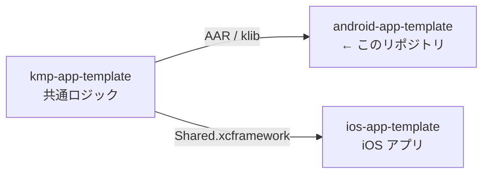

# android-app-template

> Android アプリの初期テンプレート。Jetpack Compose の 1 画面のみを含む最小構成。

## 3 リポジトリの関係

[ios-app-template](https://github.com/yossibank/ios-app-template) ・
[kmp-app-template](https://github.com/yossibank/kmp-app-template)

## コマンド

| コマンド | 内容 |
| --- | --- |
| `make verify` | デバッグ APK のビルド + ユニットテスト（変更後はこれを通す） |
| `make build` | デバッグ APK のみ |
| `make test` | ユニットテストのみ |
| `make lint` | ktlint によるチェック（`make verify` に含まれる） |
| `make format` | ktlint で自動修正 |

## 環境

| 項目 | バージョン |
| --- | --- |
| Gradle | 9.7.1 |
| Android Gradle Plugin | 9.3.2 |
| compileSdk / targetSdk | 37 |
| minSdk | 24 |
| Compose BOM | 2026.08.00 |
| 認証 | `~/.gradle/gradle.properties` に `gpr.user` / `gpr.token`（共通コアの取得に必要） |
