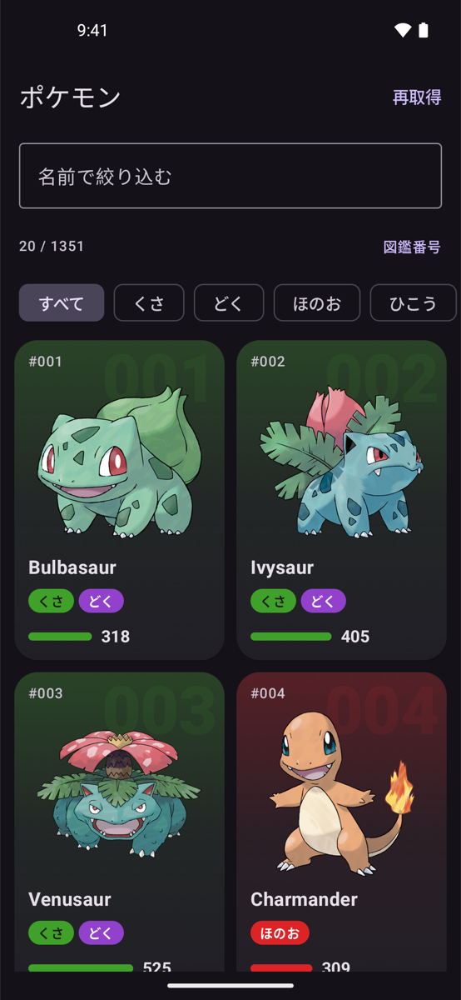
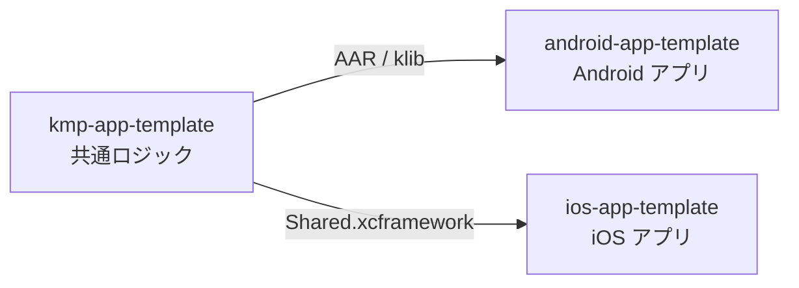
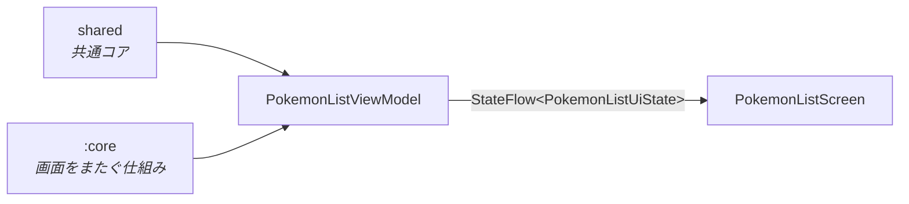

# android-app-template

Jetpack Compose で作った Android アプリのテンプレートです。題材は PokeAPI のポケモン一覧で、無限スクロール・絞り込み・並び替え・詳細シートを備えています。

データの取得とページングは Kotlin Multiplatform の共通コアが担い、このリポジトリは Android 固有の画面と状態管理だけを持ちます。

  
  

## 3 つのリポジトリ

- [kmp-app-template](https://github.com/yossibank/kmp-app-template) — 通信・ページング・エラーの分類
- [ios-app-template](https://github.com/yossibank/ios-app-template) — 同じ画面の iOS 版

## 構成

`:app` は画面、`:core` は画面をまたいで使う仕組みを持ちます。`:core` は純 JVM のモジュールで、共通コアにも Android にも依存しません。

## 技術スタック

| | |
| --- | --- |
| UI / 状態管理 | Jetpack Compose / ViewModel + StateFlow |
| 並行性 | Kotlin Coroutines |
| 画像 | Coil |
| テスト | JUnit 4 + kotlinx-coroutines-test |
| 依存管理 | Gradle（バージョンカタログ）。共通コアは GitHub Packages から取得 |

## 動かし方

1. `~/.gradle/gradle.properties` に `gpr.user` / `gpr.token` を置く（GitHub Packages から共通コアを取得するのに必要）
2. Android Studio で開くか、`make build` でビルドする

変更したら `make verify` を通します。
