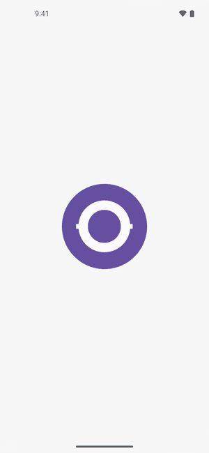
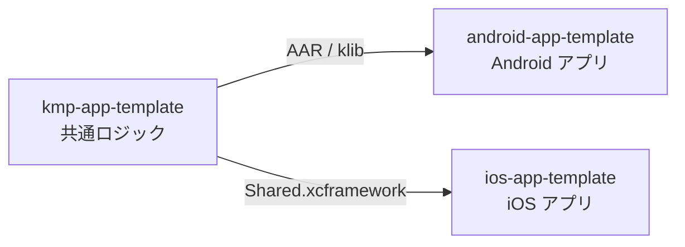
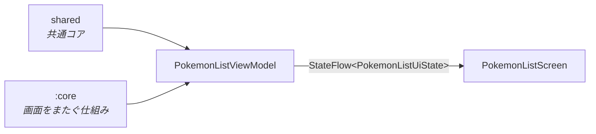

# android-app-template

Jetpack Compose と Kotlin Multiplatform で作る、ポケモン図鑑アプリのテンプレート

<picture>
  <source media="(prefers-color-scheme: dark)" srcset="docs/images/demo-dark.gif">
  
</picture>
<picture>
  <source media="(prefers-color-scheme: dark)" srcset="docs/images/list-dark.png">
  
</picture>

PokeAPI のポケモンを、無限スクロール・タイプでの絞り込み・並び替え・詳細シートで見られます。データの取得とページングは共通コア（Kotlin Multiplatform）が担い、このリポジトリは Android の画面と状態管理だけを持ちます。

## 3 つのリポジトリ

[kmp-app-template](https://github.com/yossibank/kmp-app-template) ・ [ios-app-template](https://github.com/yossibank/ios-app-template)

## 構成

| モジュール | 役割 |
| --- | --- |
| `:app` | 画面 |
| `:core` | 画面をまたいで使う仕組み。純 JVM のモジュールで、共通コアにも Android にも依存しない |

## 動かし方

> [!NOTE]
> 共通コアを GitHub Packages から取得するため、`~/.gradle/gradle.properties` に `gpr.user` / `gpr.token` が必要です。

1. Android Studio で開くか、`make build` でビルドする
2. 変更したら `make verify` を通す
