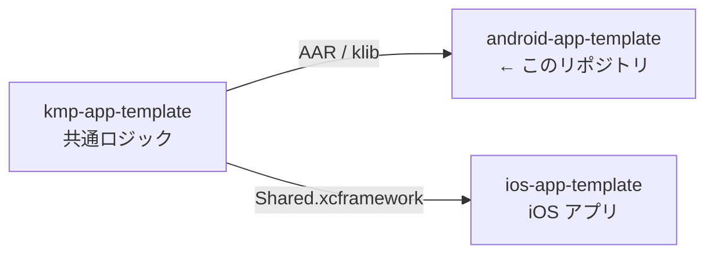
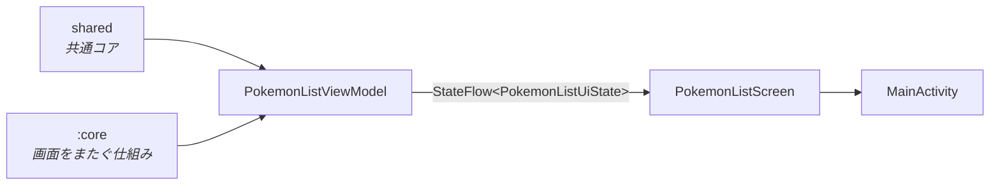

# android-app-template

> Android アプリの初期テンプレート。Jetpack Compose の 1 画面のみを含む最小構成。

書き方の規約は [CLAUDE.md](CLAUDE.md)。

## 3 リポジトリの関係



[ios-app-template](https://github.com/yossibank/ios-app-template) ・
[kmp-app-template](https://github.com/yossibank/kmp-app-template)

## モジュール構成



`:app` と `:core` の 2 モジュール。1 画面を 3 つのファイルに分ける。

| ファイル | モジュール | 役割 |
| --- | --- | --- |
| `PokemonListUiState.kt` | `:app` | 画面の状態（読み込み中 / 空 / 一覧 / 失敗） |
| `PokemonListViewModel.kt` | `:app` | 取得と状態の保持。構成変更を跨いで生き残る |
| `PokemonListScreen.kt` | `:app` | 状態を持つ Composable と、描画だけの Composable。Scaffold と AppBar も持つ |
| `PokemonPaging.kt` | `:app` | 共通コアの境界。テストで差し替える |
| `MainActivity.kt` | `:app` | 入口。テーマと画面の呼び出しだけ |
| `LatestResult.kt` | `:core` | 最後に始めた取得の結果だけを状態に書く |
| `TextMatching.kt` | `:core` | 絞り込みの一致規則。iOS の `localizedStandardContains` に合わせる |

## ディレクトリ

```
app/
├── build.gradle.kts        # 依存とビルド設定
└── src/
    ├── main/kotlin/        # 画面
    └── test/kotlin/        # ViewModel のテスト
core/
├── build.gradle.kts        # 純 JVM モジュール
└── src/
    ├── main/kotlin/        # 画面をまたいで使う仕組み
    └── test/kotlin/        # その単体テスト
gradle/
└── libs.versions.toml      # 依存とバージョン（ここにのみ書く）
```

## コマンド

| コマンド | 内容 |
| --- | --- |
| `make verify` | ktlint + デバッグ / リリースビルド + ユニットテスト（変更後はこれを通す） |
| `make build` | デバッグ APK のみ |
| `make release` | リリース APK のみ（R8 有効） |
| `make test` | ユニットテストのみ |
| `make lint` | ktlint によるチェック（`make verify` に含まれる） |
| `make format` | ktlint で自動修正 |

## 環境

| 項目 | 出所 |
| --- | --- |
| AGP・Kotlin・Compose BOM・依存 | [gradle/libs.versions.toml](gradle/libs.versions.toml) |
| Gradle | [gradle/wrapper/gradle-wrapper.properties](gradle/wrapper/gradle-wrapper.properties) |
| compileSdk / targetSdk / minSdk・Java | [app/build.gradle.kts](app/build.gradle.kts) |
| JDK（CI） | [.github/workflows/verify.yml](.github/workflows/verify.yml) |
| 認証 | `~/.gradle/gradle.properties` に `gpr.user` / `gpr.token`（共通コアの取得に必要） |
