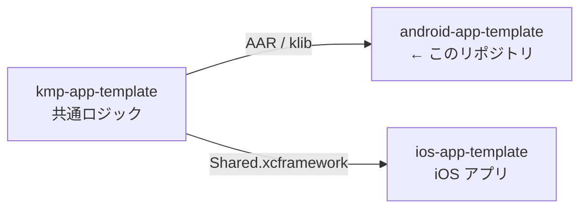
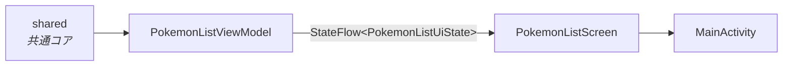

# android-app-template

> Android アプリの初期テンプレート。Jetpack Compose の 1 画面のみを含む最小構成。

書き方の規約は [CLAUDE.md](CLAUDE.md)。

## 3 リポジトリの関係



[ios-app-template](https://github.com/yossibank/ios-app-template) ・
[kmp-app-template](https://github.com/yossibank/kmp-app-template)

## モジュール構成



単一モジュール（`:app`）。1 画面を 3 つのファイルに分ける。

| ファイル | 役割 |
| --- | --- |
| `PokemonListUiState.kt` | 画面の状態（読み込み中 / 一覧 / 失敗） |
| `PokemonListViewModel.kt` | 取得と状態の保持。構成変更を跨いで生き残る |
| `PokemonListScreen.kt` | 状態を持つ Composable と、描画だけの Composable |
| `MainActivity.kt` | 入口。Scaffold と画面の呼び出しだけ |

## ディレクトリ

```
app/
├── build.gradle.kts        # 依存とビルド設定
└── src/
    ├── main/kotlin/        # 画面
    └── test/kotlin/        # ViewModel のテスト
gradle/
└── libs.versions.toml      # 依存とバージョン（ここにのみ書く）
```

## コマンド

| コマンド | 内容 |
| --- | --- |
| `make verify` | ktlint + ビルド + ユニットテスト（変更後はこれを通す） |
| `make build` | デバッグ APK のみ |
| `make test` | ユニットテストのみ |
| `make lint` | ktlint によるチェック（`make verify` に含まれる） |
| `make format` | ktlint で自動修正 |

## 環境

| 項目 | バージョン |
| --- | --- |
| Gradle | 9.7.1 |
| Android Gradle Plugin | 9.4.0 |
| Kotlin | 2.4.10 |
| compileSdk / targetSdk | 37 |
| minSdk | 24 |
| Compose BOM | 2026.08.00 |
| 認証 | `~/.gradle/gradle.properties` に `gpr.user` / `gpr.token`（共通コアの取得に必要） |
