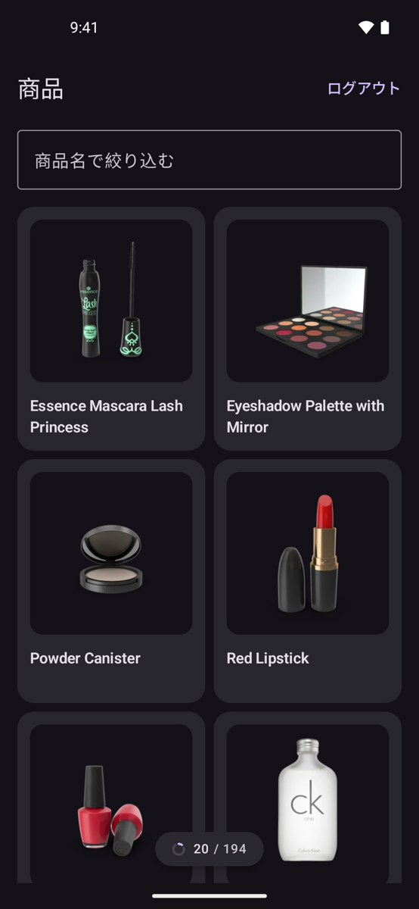
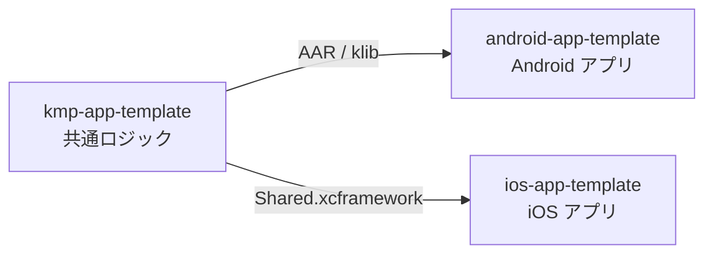
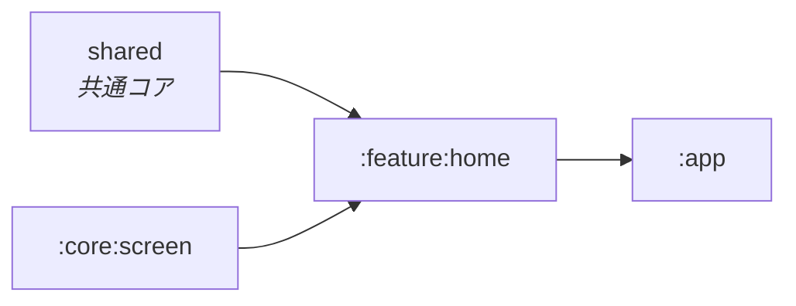

<div align="center">

# android-app-template

Jetpack Compose と Kotlin Multiplatform で作る、ポケモン図鑑アプリのテンプレート

[](https://github.com/yossibank/android-app-template/actions/workflows/verify.yml)
[](LICENSE)




</div>

PokeAPI のポケモンを、無限スクロールと名前での絞り込みで見られます。

## 3 つのリポジトリ


```mermaid
flowchart LR
    KMP["kmp-app-template<br/>共通ロジック"]
    AND["android-app-template<br/>Android アプリ"]
    IOS["ios-app-template<br/>iOS アプリ"]
    KMP -->|"AAR / klib"| AND
    KMP -->|"Shared.xcframework"| IOS
```

[kmp-app-template](https://github.com/yossibank/kmp-app-template) ・ [ios-app-template](https://github.com/yossibank/ios-app-template)

## モジュール構成


```mermaid
flowchart LR
    SHARED["shared<br/><i>共通コア</i>"]
    SCREEN[":core:screen"]
    HOME[":feature:home"]
    APP[":app"]
    SHARED --> HOME
    SCREEN --> HOME
    HOME --> APP
```

| モジュール | 役割 |
| --- | --- |
| `:core:screen` | 画面の土台（読み込み状態の管理）と、機能に依らない UI 部品 |
| `:feature:home` | 一覧の画面 |
| `:app` | 画面の組み立て |

## 動かし方

> [!NOTE]
> 共通コアを AWS CodeArtifact から取得するため、環境変数 `CODEARTIFACT_AUTH_TOKEN` にトークンが必要です（最長 12 時間有効）。
>
> ```sh
> export CODEARTIFACT_AUTH_TOKEN=$(aws codeartifact get-authorization-token --domain yossibank --domain-owner 724669215656 --region ap-northeast-1 --query authorizationToken --output text)
> ```

1. Android Studio で開くか、`make build` でビルドする
2. 変更したら `make verify` を通す

<details>
<summary>共通コアを手元のものに差し替える</summary>

kmp-app-template のディレクトリを絶対パスで渡します。このときは `CODEARTIFACT_AUTH_TOKEN` は要りません。

```sh
SHARED_DIR=/path/to/kmp-app-template make verify
```

Android Studio では `~/.gradle/gradle.properties` に `shared.dir=/path/to/kmp-app-template` を書きます。

</details>

<details>
<summary>テンプレートから作ったとき</summary>

パッケージの接頭辞と GitHub のオーナーを置き換えます。3 つのリポジトリそれぞれで実行します。

```sh
scripts/rename.sh <GitHub のオーナー> <パッケージの接頭辞>    # 例: scripts/rename.sh acme com.acme
```

</details>
